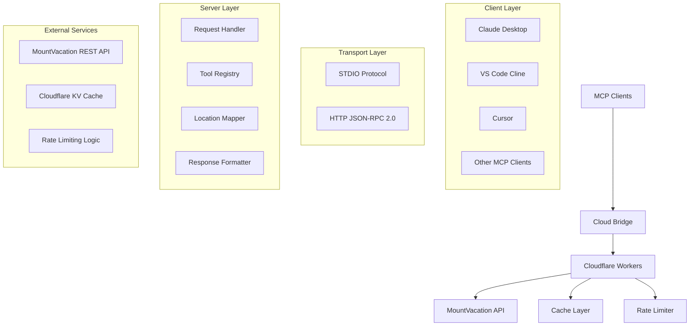

# MountVacation MCP Server - Project Blueprint

## 🏗️ **System Architecture**

### **High-Level Architecture**


### **Data Flow**
1. **Client Request** → STDIO JSON-RPC message
2. **Bridge Translation** → HTTP JSON-RPC request
3. **Server Processing** → Validate, map location, call API
4. **Response Formatting** → Structure for MCP client
5. **Bridge Response** → STDIO JSON-RPC response
6. **Client Display** → Formatted accommodation results

## 📁 **Project Structure**

```
MV-MCP-server/
├── 📁 cloudflare-workers/          # Production HTTP MCP Server
│   ├── src/
│   │   ├── index.ts                # Main server implementation
│   │   ├── types.ts                # TypeScript type definitions
│   │   └── utils.ts                # Utility functions
│   ├── package.json                # Dependencies and scripts
│   ├── wrangler.toml               # Cloudflare Workers configuration
│   └── tsconfig.json               # TypeScript configuration
│
├── 📁 python-fastmcp/              # Local Python MCP Server
│   ├── mountvacation_mcp.py        # FastMCP implementation
│   ├── requirements.txt            # Python dependencies
│   └── venv/                       # Virtual environment
│
├── 📁 scripts/                     # Development and testing scripts
│   ├── mcp-cloud-bridge.js         # Cloud bridge (in repo)
│   ├── test-deployed-server.js     # Integration testing
│   └── setup-local-server.sh       # Local setup automation
│
├── 📁 client-configs/              # Ready-to-use client configurations
│   ├── claude-desktop-cloud.json   # Cloud server config
│   ├── claude-desktop-local.json   # Local server config
│   ├── vscode-cline-local.json     # VS Code Cline config
│   └── cursor.json                 # Cursor IDE config
│
├── 📁 docs/                        # Comprehensive documentation
│   ├── HANDOFF_DOCUMENTATION.md    # Development handoff guide
│   ├── PROJECT_BLUEPRINT.md        # This file - system overview
│   ├── CLIENT_INTEGRATION.md       # Client setup instructions
│   ├── API_REFERENCE.md            # API documentation
│   └── TROUBLESHOOTING.md          # Common issues and solutions
│
├── standalone-cloud-bridge.js      # Standalone bridge script
├── README.md                       # Main project documentation
├── .env.example                    # Environment variables template
└── .gitignore                      # Git ignore rules
```

## 🔧 **Core Components**

### **1. Cloudflare Workers MCP Server** (`cloudflare-workers/src/index.ts`)
**Purpose**: Production HTTP-based MCP server  
**Key Functions**:
- `handleMCPRequest()`: Main request router
- `handleToolsList()`: Returns available tools
- `handleToolCall()`: Processes accommodation searches
- `handleSearchAccommodations()`: Core search logic
- `createSuccessResponse()` / `createErrorResponse()`: Response helpers

**Dependencies**: None (pure Node.js/Web APIs)  
**Deployment**: Cloudflare Workers with Wrangler

### **2. Cloud Bridge** (`standalone-cloud-bridge.js`)
**Purpose**: Converts STDIO MCP protocol to HTTP requests  
**Key Functions**:
- STDIO input/output handling
- JSON-RPC message parsing
- HTTP request forwarding
- MCP initialization handshake
- Error handling and timeouts

**Dependencies**: Node.js built-in modules only  
**Usage**: Referenced in Claude Desktop configuration

### **3. Python Local Server** (`python-fastmcp/mountvacation_mcp.py`)
**Purpose**: Local development and advanced users  
**Key Functions**:
- FastMCP framework integration
- Direct API calls without HTTP overhead
- Local environment variable handling
- Development testing capabilities

**Dependencies**: FastMCP, requests, python-dotenv  
**Usage**: Local development and users preferring local control

### **4. Location Mapping System**
**Purpose**: Maps user location queries to MountVacation API location IDs  
**Implementation**: Embedded in both servers  
**Data Structure**:
```typescript
const LOCATION_MAPPINGS = {
  'madonna di campiglio': 1234,
  'italian dolomites': 5678,
  'kronplatz': 9012,
  // ... more mappings
};
```

## 🛠️ **Development Patterns**

### **Error Handling Strategy**
1. **Input Validation**: Validate all parameters before processing
2. **API Error Mapping**: Convert API errors to user-friendly messages
3. **Fallback Responses**: Provide helpful suggestions when no results found
4. **Timeout Handling**: Graceful handling of slow API responses
5. **Debug Logging**: Comprehensive logging for troubleshooting

### **Caching Strategy**
- **Location Queries**: Cache successful location mappings
- **API Responses**: Cache accommodation results for 5 minutes
- **Error Responses**: Cache "no results" responses for 1 minute
- **Cache Keys**: Based on location + date + guest parameters

### **Rate Limiting**
- **Per-Client Limits**: 60 requests per minute per client
- **Global Limits**: Respect MountVacation API rate limits
- **Backoff Strategy**: Exponential backoff for failed requests

## 🔌 **API Integration**

### **MountVacation API**
**Base URL**: `https://api.mountvacation.com/`  
**Authentication**: API Key in headers  
**Key Endpoints**:
- `GET /locations` - Search locations
- `GET /accommodations` - Search accommodations
- `GET /availability` - Check availability

**Request Format**:
```json
{
  "location_id": 1234,
  "arrival_date": "2026-01-15",
  "departure_date": "2026-01-22",
  "persons_ages": "30,28",
  "currency": "EUR"
}
```

**Response Processing**:
1. Parse API response
2. Format for MCP client consumption
3. Add booking links and contact information
4. Handle pagination if needed

## 🧪 **Testing Strategy**

### **Test Levels**
1. **Unit Tests**: Individual function testing
2. **Integration Tests**: API integration testing
3. **End-to-End Tests**: Full client-to-server testing
4. **Performance Tests**: Load and response time testing

### **Test Scripts**
- `scripts/test-deployed-server.js`: Production server testing
- Manual testing with various MCP clients
- Health check monitoring
- Error scenario testing

### **Test Data**
- Known working locations (Madonna di Campiglio)
- Invalid locations for error testing
- Edge cases (invalid dates, ages)
- Performance test scenarios

## 🚀 **Deployment Pipeline**

### **Cloudflare Workers Deployment**
1. **Build**: `npm run build` (TypeScript compilation)
2. **Deploy**: `wrangler deploy --env production`
3. **Verify**: Health check and integration tests
4. **Monitor**: Check logs and performance metrics

### **Environment Management**
- **Development**: Local testing with `wrangler dev`
- **Staging**: Separate Cloudflare Workers environment
- **Production**: Live deployment with monitoring

### **Rollback Strategy**
- **Version Control**: Git tags for releases
- **Cloudflare Rollback**: Previous deployment restoration
- **Health Monitoring**: Automated rollback on failures

## 📊 **Monitoring & Analytics**

### **Key Metrics**
- **Response Time**: Average and 95th percentile
- **Success Rate**: Percentage of successful requests
- **Error Rate**: Types and frequency of errors
- **Usage Patterns**: Popular locations and times

### **Monitoring Tools**
- **Cloudflare Analytics**: Built-in performance metrics
- **Health Checks**: Automated uptime monitoring
- **Log Analysis**: Error pattern detection
- **User Feedback**: Integration success rates

## 🔮 **Future Architecture Considerations**

### **Scalability**
- **Multi-Region Deployment**: Global edge deployment
- **Database Integration**: Persistent location and user data
- **Microservices**: Split into specialized services
- **Load Balancing**: Handle high traffic scenarios

### **Feature Extensions**
- **Real-time Data**: Live availability updates
- **Booking Integration**: Direct reservation capabilities
- **Multi-API Support**: Additional accommodation providers
- **Advanced Filtering**: Complex search criteria

### **Technology Evolution**
- **WebAssembly**: Performance-critical components
- **GraphQL**: More flexible API queries
- **Streaming**: Real-time result updates
- **AI Integration**: Smart location suggestions

---

**Blueprint Version**: 1.0.0  
**Last Updated**: September 23, 2025  
**Architecture Status**: Production Ready ✅
